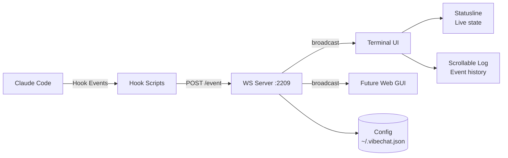

# 🚀 VibeCoder Studio

> **Enhanced Claude Code environment для начинающих вайбкодеров.**
> Прозрачность, автоматизация и удобство для тех, кто пишет код с ИИ.

---

## 📋 О проекте

VibeCoder Studio — это набор инструментов, превращающий Claude Code в полноценную среду разработки с:

- **VibeChat** — enhanced terminal UI с системой Full Debug нотификаций (statusline + scrollable log)
- **VibeTasks** — управление задачами и их отслеживание
- **VibeHub** — обучающий центр для вайб-кодеров
- **VibeGit** — GitHub автоматизация

> ⚡ **Текущий статус**: Разработка VibeChat (MVP-фаза)

---

## 📦 Структура репозитория

```text
├── .claude/                          # Claude Code конфигурация
│   └── hooks/                        # Hook скрипты для Claude Code
├── .specify/                         # Speckit — spec-driven development
│   ├── memory/                       # Память проекта (constitution)
│   └── templates/                    # Шаблоны spec/plan/tasks
├── specs/                            # Спецификации и планы
│   └── 001-vibechat-terminal-ui/     # VibeChat — первая фича
│       ├── spec.md                   # Требования
│       ├── plan.md                   # План реализации
│       ├── research.md               # Исследование архитектуры
│       ├── data-model.md             # Модели данных
│       ├── contracts/                # Контракты интерфейсов
│       ├── quickstart.md             # Быстрый старт
│       ├── tasks.md                  # Таски имплементации (27 шт)
│       └── checklists/              # Чеклисты качества
├── graphify-out/                     # Knowledge graph проекта
├── CLAUDE.md                         # Инструкции для Claude Code
├── README.md                         # Этот файл
└── icon.png                          # Иконка проекта
```

---

## 🎯 Компоненты

### VibeChat [В РАЗРАБОТКЕ] — `specs/001-vibechat-terminal-ui/`

Enhanced терминальный UI для Claude Code с Full Debug нотификациями:

| Возможность | Статус | Описание |
|-------------|--------|----------|
| 🖥️ Statusline | 🔜 Фаза 3 | Живая строка состояния агента (мысли, инструменты, субагенты) |
| 📜 Scrollable Log | 🔜 Фаза 3 | Прокручиваемая история всех событий |
| 🔔 Full Debug | 🔜 Фаза 3 | ToolUse, Thinking, Subagents, Tokens, Timing, ModelSwitch, Permissions |
| 🔧 Настройка фильтров | 🔜 Фаза 4 | Выбор типов отображаемых уведомлений |
| 🌐 WebSocket API | 🔜 Фаза 2 | Основа для будущего веб-интерфейса |

**Архитектура**: Claude Code Hooks → WebSocket Server → Terminal UI

### VibeTasks [ПЛАН] — Управление задачами
- Создание/отслеживание задач
- Привязка к сессиям Claude Code
- Приоритизация и статусы

### VibeHub [ПЛАН] — Обучающий центр
- Обучение промпт-инжинирингу
- Лучшие практики вайб-кодинга
- Библиотека паттернов

### VibeGit [ПЛАН] — GitHub автоматизация
- Коммиты и PR из Claude Code
- Code Review автоматизация
- CI/CD интеграция

---

## 🚀 Быстрый старт (VibeChat)

### Предварительные требования

```bash
node --version  # ≥ 18.x
curl --version  # для hook скриптов
```

### Установка

```bash
# 1. Клонировать репозиторий
git clone <repo-url> vibecoder-studio
cd vibecoder-studio

# 2. Установить зависимости
npm install

# 3. (Скоро) Запустить WebSocket сервер
node server/index.js

# 4. Запустить Claude Code (в другом терминале)
claude
```

### Конфигурация

```bash
# Настройка фильтров уведомлений (опционально)
# ~/.vibechat.json создаётся автоматически
echo '{"filters":{"TokenCount":false,"Timing":true}}' > ~/.vibechat.json
```

---

## 🧠 Конституция проекта

Проект управляется [Конституцией](.specify/memory/constitution.md) — 5 принципов:

1. **Ленивая эффективность** — сначала YAGNI, stdlib, native
2. **Hook-First автоматизация** — хуки вместо инструкций в памяти
3. **Композируемая архитектура** — каждый компонент независим и заменяем
4. **Безопасность на границах** — валидация там, где входят данные
5. **Итеративная доставка** — MVP сначала, потом улучшения

> 🔗 Полный текст: [`.specify/memory/constitution.md`](.specify/memory/constitution.md)

---

## 🛠️ Development Workflow

```text
/speckit-specify    →  Создать спецификацию
/speckit-checklist  →  Проверить качество требований
/speckit-plan       →  Создать план реализации
/speckit-tasks      →  Разбить на задачи
                    →  Имплементация (Agents)
/graphify update .  →  Обновить граф знаний
```

### Текущая сессия разработки

```text
📋 VibeChat Terminal UI
├── ✅ Spec  — specs/001-vibechat-terminal-ui/spec.md
├── ✅ Plan  — specs/001-vibechat-terminal-ui/plan.md
├── ✅ Tasks — specs/001-vibechat-terminal-ui/tasks.md (27 tasks)
├── ⏳ Implementation — фазы 1-2 (Setup + Foundational)
└── ⏳ MVP Delivery   — фаза 3 (Core: hooks + UI)
```

---

## 📚 Навигация по документам

| Документ | Назначение |
|----------|-----------|
| [CLAUDE.md](CLAUDE.md) | Инструкции для Claude Code агентов |
| [SPECIFICATION](specs/001-vibechat-terminal-ui/spec.md) | VibeChat требования и user stories |
| [PLAN](specs/001-vibechat-terminal-ui/plan.md) | Архитектура и план реализации |
| [TASKS](specs/001-vibechat-terminal-ui/tasks.md) | Конкретные задачи (27 шт) |
| [RESEARCH](specs/001-vibechat-terminal-ui/research.md) | Архитектурные решения |
| [DATA MODEL](specs/001-vibechat-terminal-ui/data-model.md) | Модели данных и типы событий |
| [CONTRACTS](specs/001-vibechat-terminal-ui/contracts/) | Event schemas, WS protocol, Hook contracts |
| [QUICKSTART](specs/001-vibechat-terminal-ui/quickstart.md) | Сценарии валидации |
| [CONSTITUTION](.specify/memory/constitution.md) | Принципы разработки |

---

## 🏗️ Архитектура VibeChat



---

## 🤝 Как внести вклад

1. Выбери компонент из списка выше
2. Прочитай соответствующую спецификацию в `specs/`
3. Используй `/speckit-specify` для новой фичи
4. Следуй чеклисту качества требований
5. После одобрения — план, таски, имплементация

---

## 📄 Лицензия

MIT — делайте что хотите, но помните: код написан человеком и ИИ вместе 🌟

---

## 🧠 Знания проекта

Проект использует **mem0** для сохранения решений и контекста между сессиями. Каждое значимое решение сохраняется автоматически.

---

<p align="center">
  <sub>Сделано с ❤️ для вайб-кодеров. Code in the flow. 🎧</sub>
</p>
